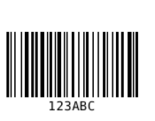
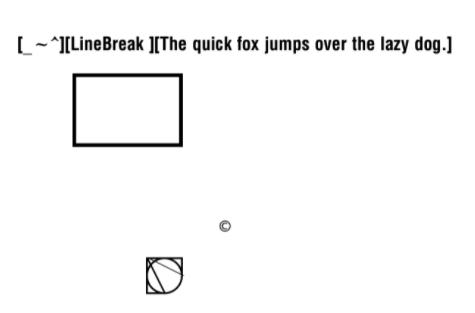
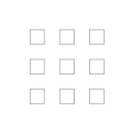

# BinaryKits.Zpl

This project contains several modules for working with Zebra Programming Language. ZPL is a very common printer language that is supported by various manufacturers.
The project helps you to describe a label and generates a preview from the ZPL data. We can convert different image formats to the Zebra image format. The image data is compressed to cause as little traffic as possible. More information about Zebra printer languages can be found in the [ZPL Documentation](https://www.zebra.com/content/dam/zebra/manuals/printers/common/programming/zpl-zbi2-pm-en.pdf).

## What modules does the project offer

- **BinaryKits.Zpl.Label**<br>
This module provides the basic building blocks of the ZPL language and the logic for converting the images into the correct format.
- **BinaryKits.Zpl.Labelary**<br>
This module is a client for the Labelary project with which a preview can be generated from ZPL data.
- **BinaryKits.Zpl.Protocol**<br>
This module contains the raw commands of the Zebra protocol.
- **BinaryKits.Zpl.Viewer**<br>
This module is our own implementation of a viewer. It converts the ZPL data into an image like Labelary but does it locally. [Try our viewer](https://binarykits-zpl-viewer.azurewebsites.net). The viewer is also available as a [docker container](https://hub.docker.com/r/yipingruan/binarykits-zpl)

## How can I use it?

The packages are available via [](https://www.nuget.org/packages/BinaryKits.Zpl.Label)

| Package Manager | .NET CLI |
| ------------- | ------------- |
| ``` PM> install-package BinaryKits.Zpl.Label ``` | ``` > dotnet add package BinaryKits.Zpl.Label ``` |
| ``` PM> install-package BinaryKits.Zpl.Labelary ``` | ``` > dotnet add package BinaryKits.Zpl.Labelary ``` |
| ``` PM> install-package BinaryKits.Zpl.Viewer ``` | ``` > dotnet add package BinaryKits.Zpl.Viewer ``` |
| ``` PM> install-package BinaryKits.Zpl.Protocol ``` | ``` > dotnet add package BinaryKits.Zpl.Protocol ``` |

## Supported Elements

This library supports following elements:

| Element | Informations |
| ------------- | ------------- |
| Barcode | ANSI Codabar, Code 39, Code 128, EAN-13, Interleaved 2 of 5 |
| QR-Code | - |
| Image | DownloadObjects, DownloadGraphics  |
| Text | TextBlock, TextField, FieldBlock, SingleLineFieldBlock |
| Drawing | GraphicBox, DiagonalLine, Circle, Ellipse |

## Is there a way to generate a preview?

There are several ways to view the result from the ZPL data.

| Variant | Description |
| ------------- | ------------- |
| [labelary.com](http://labelary.com/viewer.html) | A widely used and accurate solution. Unfortunately, there is no information who runs the project. Therefore, no customer information should be sent to this service. |
| [BinaryKits.Zpl.Viewer](https://www.nuget.org/packages/BinaryKits.Zpl.Viewer) | This viewer is part of our project, it is open source and can be easily used on your infrastructure. [Demo](https://binarykits-zpl-viewer.azurewebsites.net) |
| [Zpl Printer](https://chrome.google.com/webstore/detail/zpl-printer/phoidlklenidapnijkabnfdgmadlcmjo) | A Chrome plugin that simulates a network printer on port 9100 in the background the label is then sent to a Labelary API and displayed. |

## How can I send the generated data to my printer?

For example, the data can be transmitted to the printer IpAddress on port 9100.

```cs
var zplData = @"^XA^MMP^PW300^LS0^LT0^FT10,60^APN,30,30^FH\^FDSAMPLE TEXT^FS^XZ";
// Open connection
var tcpClient = new System.Net.Sockets.TcpClient();
tcpClient.Connect("10.10.5.85", 9100);

// Send Zpl data to printer
var writer = new System.IO.StreamWriter(tcpClient.GetStream());
writer.Write(zplData);
writer.Flush();

// Close Connection
writer.Close();
tcpClient.Close();
```

## Examples to describe Labels

### Using statement

```cs
using BinaryKits.Zpl.Label;
using BinaryKits.Zpl.Label.Elements;
```

### Single element

```cs
var output = new ZplGraphicBox(100, 100, 100, 100).ToZplString();
Console.WriteLine(output);
```

### Barcode 128

```cs
var output = new ZplBarcode128("123ABC", 10, 50).ToZplString();
Console.WriteLine(output);
```



### Whole label

```cs
var sampleText = "[_~^][LineBreak\n][The quick fox jumps over the lazy dog.]";
var font = new ZplFont(fontWidth: 50, fontHeight: 50);
var elements = new List<ZplElementBase>();
elements.Add(new ZplTextField(sampleText, 50, 100, font));
elements.Add(new ZplGraphicBox(400, 700, 100, 100, 5));
elements.Add(new ZplGraphicBox(450, 750, 100, 100, 50, LineColor.White));
elements.Add(new ZplGraphicCircle(400, 700, 100, 5));
elements.Add(new ZplGraphicDiagonalLine(400, 700, 100, 50, 5));
elements.Add(new ZplGraphicDiagonalLine(400, 700, 50, 100, 5));
elements.Add(new ZplGraphicSymbol(GraphicSymbolCharacter.Copyright, 600, 600, 50, 50));

// Add raw Zpl code
elements.Add(new ZplRaw("^FO200, 200^GB300, 200, 10 ^FS"));

var renderEngine = new ZplEngine(elements);
var output = renderEngine.ToZplString(new ZplRenderOptions { AddEmptyLineBeforeElementStart = true });

Console.WriteLine(output);
```

Sample code: https://dotnetfiddle.net/cnJ1XG



### Simple layout

```cs
var elements = new List<ZplElementBase>();

var origin = new ZplOrigin(100, 100);
for (int i = 0; i < 3; i++)
{
    for (int j = 0; j < 3; j++)
    {
        elements.Add(new ZplGraphicBox(origin.PositionX, origin.PositionY, 50, 50));
        origin = origin.Offset(0, 100);
    }
    origin = origin.Offset(100, -300);
}

var options = new ZplRenderOptions();
var output = new ZplEngine(elements).ToZplString(options);

Console.WriteLine(output);
```


### Auto scale based on DPI

```cs
var elements = new List<ZplElementBase>();
elements.Add(new ZplGraphicBox(400, 700, 100, 100, 5));

var options = new ZplRenderOptions { SourcePrintDpi = 203, TargetPrintDpi = 300 };
var output = new ZplEngine(elements).ToZplString(options);

Console.WriteLine(output);
```
### Render with comment for easy debugging

```cs
var elements = new List<ZplElementBase>();

var textField = new ZplTextField("AAA", 50, 100, ZplConstants.Font.Default);
textField.Comments.Add("An important field");
elements.Add(textField);

var renderEngine = new ZplEngine(elements);
var output = renderEngine.ToZplString(new ZplRenderOptions { DisplayComments = true });

Console.WriteLine(output);
```

### Different text field type

```cs
var sampleText = "[_~^][LineBreak\n][The quick fox jumps over the lazy dog.]";
var font = new ZplFont(fontWidth: 50, fontHeight: 50);

var elements = new List<ZplElementBase>();
// Special character is repalced with space
elements.Add(new ZplextField(sampleText, 10, 10, font, useHexadecimalIndicator: false));
// Special character is repalced Hex value using ^FH
elements.Add(new ZplTextField(sampleText, 10, 50, font, useHexadecimalIndicator: true));
// Only the first line is displayed
elements.Add(new ZplSingleLineFieldBlock(sampleText, 10, 150, 500, font));
// Max 2 lines, text exceeding the maximum number of lines overwrites the last line.
elements.Add(new ZplFieldBlock(sampleText, 10, 300, 400, font, 2));
// Multi - line text within a box region
elements.Add(new ZplTextBlock(sampleText, 10, 600, 400, 100, font));

var renderEngine = new ZplEngine(elements);
var output = renderEngine.ToZplString(new ZplRenderOptions { AddEmptyLineBeforeElementStart = true });

Console.WriteLine(output);
```

### Draw pictures

> For the best image result, first convert your graphic to black and white. The library auto resize the image based on DPI.

You have 2 possibilities to transfer the graphic to the printer:

#### 1. ZplDownloadObjects (Use ~DY and ^IM)
With this option, the image is sent to the printer in the original graphic format and the printer converts the graphic to a black and white graphic

```cs
var elements = new List<ZplElementBase>();
elements.Add(new ZplDownloadObjects('R', "SAMPLE.BMP", System.IO.File.ReadAllBytes("sample.bmp")));
elements.Add(new ZplImageMove(100, 100, 'R', "SAMPLE", "BMP"));

var renderEngine = new ZplEngine(elements);
var output = renderEngine.ToZplString(new ZplRenderOptions { AddEmptyLineBeforeElementStart = true, TargetPrintDpi = 300, SourcePrintDpi = 200 });

Console.WriteLine(output);
```

#### 2. ZplDownloadGraphics (Use ~DG and ^XG)
With this option, the image is converted from the library into a black and white graphic and the printer already receives the finished print data

```cs
var elements = new List<ZplElementBase>();
elements.Add(new ZplDownloadGraphics('R', "SAMPLE", System.IO.File.ReadAllBytes("sample.bmp")));
elements.Add(new ZplRecallGraphic(100, 100, 'R', "SAMPLE"));

var renderEngine = new ZplEngine(elements);
var output = renderEngine.ToZplString(new ZplRenderOptions { AddEmptyLineBeforeElementStart = true, TargetPrintDpi = 600, SourcePrintDpi = 200 });

Console.WriteLine(output);
```
Sample code: https://dotnetfiddle.net/ug84VY

## Example to use the Viewer

```cs
IPrinterStorage printerStorage = new PrinterStorage();
var drawer = new ZplElementDrawer(printerStorage);

var analyzer = new ZplAnalyzer(printerStorage);
var analyzeInfo = analyzer.Analyze("^XA^FT100,100^A0N,67,0^FDTestLabel^FS^XZ");

foreach (var labelInfo in analyzeInfo.LabelInfos)
{
    var imageData = drawer.Draw(labelInfo.ZplElements);
    File.WriteAllBytes("label.png", imageData);
}
```

### Font mapping

ZPL font download commands are not supported. You can provide a font mapping logic to the viewer if:

- You are hosting or using the `BinaryKits.Zpl.Viewer`
- The font is properly installed on the system

```cs
using SkiaSharp;

string zplString = @"^XA^FO20, 20^A1N,40, 30 ^FD西瓜^FS^FO20, 50^A0N,40, 30 ^FDABCDEFG^FS^XZ";

var drawOptions = new DrawerOptions()
{
    FontLoader = fontName =>
    {
        if (fontName == "0")
        {
            return SKTypeface.FromFamilyName("Arial", SKFontStyleWeight.Bold, SKFontStyleWidth.Normal, SKFontStyleSlant.Upright);
        }
        else if (fontName == "1")
        {
            return SKTypeface.FromFamilyName("SIMSUN");
        }

        return SKTypeface.Default;
    }
};

IPrinterStorage printerStorage = new PrinterStorage();
var drawer = new ZplElementDrawer(printerStorage, drawOptions);
var analyzer = new ZplAnalyzer(printerStorage);
var analyzeInfo = analyzer.Analyze(zplString);

foreach (var labelInfo in analyzeInfo.LabelInfos)
{
    var imageData = drawer.Draw(labelInfo.ZplElements, 300, 300, 8);
    File.WriteAllBytes("test.png", imageData);
}
```

## Printer manufacturers that support zpl

| Manufacturer | Simulator |
| ------------- | ------------- |
| [Zebra Technologies](https://www.zebra.com) | - |
| [Honeywell International Inc](https://sps.honeywell.com) | ZSIM |
| [Avery Dennison](https://www.averydennison.com) | MLI (Monarch Language Interpreter) |
| [cab Produkttechnik GmbH & Co. KG](https://www.cab.de) | |
| [AirTrack](https://airtrack.com) | |
| [SATO](https://www.satoeurope.com) | SZPL |
| [printronix](https://www.printronix.com) | ZGL |
| [Toshiba Tec](https://www.toshibatec.eu) | |
| [GoDEX](https://www.godexintl.com) | GZPL |

## Alternative projects

| Language | Project |
| ------------- | ------------- |
| JavaScript | [JSZPL](https://github.com/DanieLeeuwner/JSZPL) |
| .NET | [sharpzebra](https://github.com/rkone/sharpzebra) |
| .NET | [PDFtoZPL](https://github.com/sungaila/PDFtoZPL) |
